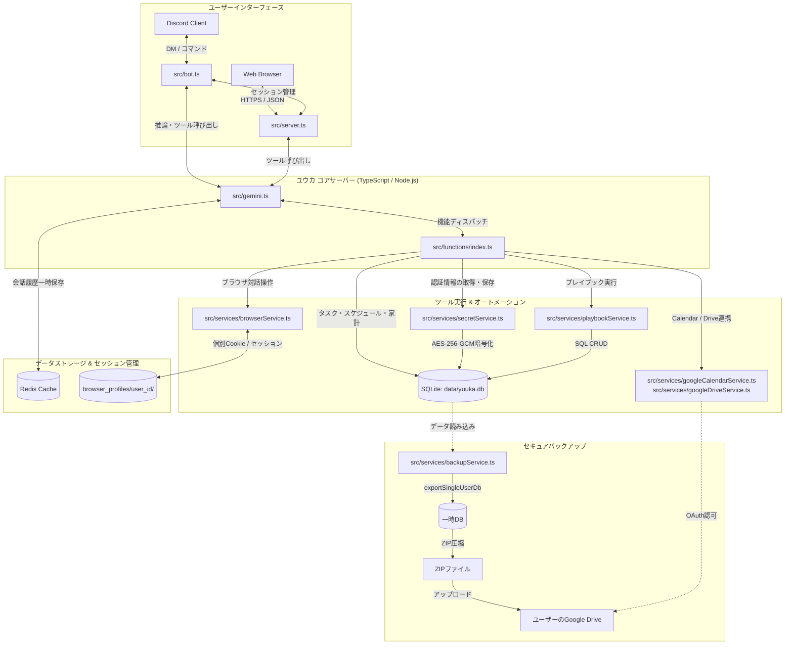

# 秘書ボット「ユウカ (Yuuka)」プロジェクト アーキテクチャ概説

本ドキュメントでは、Discord & Web 対応のマルチユーザー型AI秘書システム「ユウカ（Yuuka）」の全体概要、技術スタック、システムアーキテクチャ、データ分離（マルチユーザー分離）設計、および主要コンポーネントについて詳細に解説します。

---

## 📌 プロジェクト概要

「ユウカ」は、**Gemini AI**の強力な自律的思考・実行能力（Function Calling）を基盤とした、対話型の高度AI個人秘書ボットです。
Discord DMやWebダッシュボードを通じてユーザーとコミュニケーションを取り、日常タスク、スケジュール管理、支出管理、認証情報管理、さらにはWebブラウジングや独自手順書（Playbook）の実行までをシームレスに行うことができます。

### 主な特徴
- **マルチユーザー完全対応**: 各ユーザーのデータは完全に分離されており、情報の混在や漏洩がありません。
- **高機能ブラウザ自動化**: PuppeteerとRust製クローラーによる高速スクレイピングと、人間同等のWebインタラクション能力。
- **堅牢なセキュリティシステム**: 資格情報（Credential）をサーバー独自の秘密鍵で暗号化（AES-256-GCM）し、データベースへ安全に保管。
- **自律的プレイブック実行**: ユーザーが定義したカスタム操作手順書（Playbook）に沿って、AI自身がWebログインからデータ収集までを自動実行。
- **個人ドライブ連携バックアップ**: ユーザー個人のGoogle Driveに、そのユーザー自身のデータのみを自動エクスポートしてバックアップ。

---

## 🛠️ 技術スタック (Technology Stack)

| レイヤー | 技術 / ライブラリ | 役割・説明 |
|---|---|---|
| **コアランタイム** | Node.js (v24+) / TypeScript | 高性能かつ柔軟な非同期イベント駆動型実行環境（ES Modules） |
| **AI エンジン** | Google Gemini API (v1.5/2.0) | メインの推論、意図解析、Function Callingディスパッチ |
| **インターフェース** | Discord.js (v14) / Express | Discord DMチャネルをメインUIとし、Web管理画面も提供 |
| **データベース** | SQLite (better-sqlite3) | 軽量・高速なリレーショナルデータストア |
| **メモリ / キャッシュ** | Redis | 高速な会話履歴キャッシュおよびロック管理 |
| **Webオートメーション** | Puppeteer & Rust Crawler (`yuuka-crawler`) | 高速静的ページ取得と高度なブラウザ操作 |
| **外部API連携** | Google APIs (Calendar, Drive) | スケジュール自動同期、ユーザー固有データバックアップ |

---

## 🏗️ システムアーキテクチャ (Architecture Diagram)

システムは、フロントエンドUI、コアサーバーロジック、AI推論レイヤー、データストレージ、および外部オートメーションサービスから構成されます。

---

## 🔒 厳密なマルチユーザーデータ分離設計

本システムは、複数ユーザーが同じサーバーとDBを共有して利用することを前提としており、**データ漏洩およびセッション混在を100%排除**する極めて強固なアイソレーションが実装されています。

### 1. データベースレイヤーのフィルタリング
SQLite内のすべてのテーブル（`tasks`, `schedules`, `expenses`, `chat_history`, `credentials`, `playbooks`）は、主キーまたは外部キーとして `user_id` (Discord ID) を持っています。
すべてのデータアクセス（取得・挿入・削除・更新）クエリには、常に `WHERE user_id = ?` が強制的に組み込まれており、他ユーザーの領域にクエリが及ぶことはありません。

### 2. ブラウザプロファイルの物理的隔離
Puppeteerを用いたインタラクティブブラウザは、ユーザーごとに完全に独立したブラウザインスタンスとプロファイルディレクトリを作成して管理されます。
- プロファイル保存先: `data/browser_profiles/${userId}/`
これにより、ユーザーAがブラウザでWebサイトにログインした際のCookie、セッション、パスワード、および画面のキャッシュデータが、ユーザーBの操作画面やAPIを通じて露出・干渉することは一切ありません。また、一定時間の無操作でブラウザプロセスは自動クローズされ、リソース消費を最小化します。

### 3. 一時チャット履歴のRedis隔離
会話の履歴やAIコンテキスト状態は、Redis上で `yuuka:chat_history:${userId}` という個別のネームスペースキーを用いて管理されており、他ユーザーとチャット文脈が交差することはありません。

### 4. セキュア・バックアップ・アイソレーション
自動バックアップ（`runBackup`）は、SQLiteのファイルを丸ごとコピーするのではなく、**実行ユーザー本人の関連データのみを抽出し、その場で新しい一時SQLiteデータベースを作成（`exportSingleUserDb`）してZIP化**します。
このZIPファイルをユーザー個別のGoogle Driveフォルダにアップロードするため、バックアップファイル経由の他者データ漏洩も100%防止されています。

---

## 🧩 主要コンポーネントと役割

### 1. `src/bot.ts` (Discord Bot インターフェース)
Discordゲートウェイと接続し、ユーザーからのDM入力を監視・制御します。
- ユーザーのメッセージをパースして `src/gemini.ts` に送信。
- レスポンスとして返ってきたテキスト（および画像）をDiscordチャネルに配送。
- 未登録のユーザーからのアクセスを入り口で完全ブロック。

### 2. `src/server.ts` (Webダッシュボード ＆ API)
Webベースのユーザー設定画面を提供します。
- 安全なセッションクッキーを用いた独自認証システム。
- ログイン制限（同一IPからの連続失敗防止レートリミット）。
- 各種設定（APIキー、Google連携、バックアップスケジュール）の管理UI。

### 3. `src/gemini.ts` (Gemini コア連携)
AIモデルの実行と対話管理を司ります。
- ユーザーごとに独立したシステムプロンプトの動的構築。
- Geminiの「Function Calling（ツールコール）」機能を利用し、AI自身に必要な関数（タスク登録、ブラウジング等）を自律選択させる。
- 構造化データ出力（Structured Output）による精度の高いレスポンス生成。

### 4. `src/services/browserService.ts` (ブラウザ自動化)
PuppeteerとRustクローラーを組み合わせたインテリジェントWeb制御サービスです。
- `browserInteractiveOpen` / `browserInteractiveClick` / `browserInteractiveType` などの対話操作APIの実装。
- ページ内の全フォーム要素・ボタンに一意の `data-yuuka-id` を自動付与し、AIが確実に要素を指定して操作できるアノテーションシステム。
- 実行速度を極限まで高めるため、静的ページの取得にはRustで書かれた軽量・高速クローラー `yuuka-crawler` を自動優先使用。

### 5. `src/services/secretService.ts` (資格情報暗号化)
Webログイン等で使用するユーザーのパスワードやトークンを保護します。
- サーバーに配置されたマスターキーを用いて、ユーザーデータを **AES-256-GCM** で安全に暗号化してDB保存。
- 復号に必要な「初期化ベクトル（IV）」と「認証タグ（Tag）」も強固に管理。

---

## 📈 拡張性と今後の開発

「ユウカ」は高度にモジュール化されており、以下の方法で新しいスキルを簡単に追加できます。
1. **新規ツールの追加**: `src/functions/` 内に新しいTypeScript関数を作成し、`src/functions/index.ts` の `tools` 定義に追加するだけで、AIはそれを自動的に認識して使いこなすようになります。
2. **プレイブックの定義**: 複雑な手続き（特定のWebページで売上を確認して要約するなど）は、ユーザーが手順書（Playbook）として対話形式で保存することで、AIはコード変更なしに新しい業務を記憶・再現できます。
